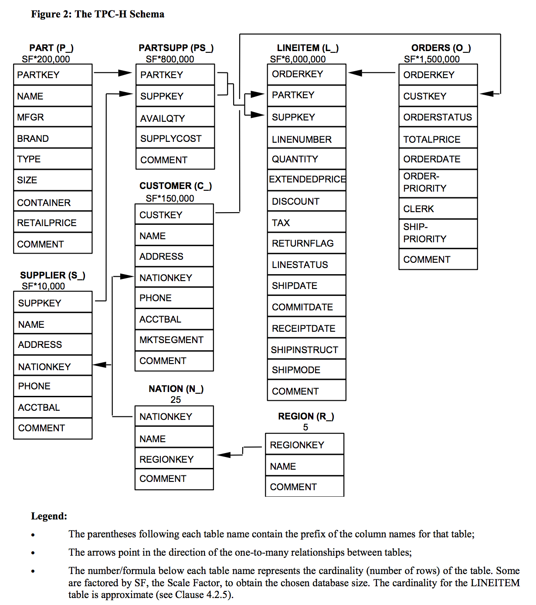
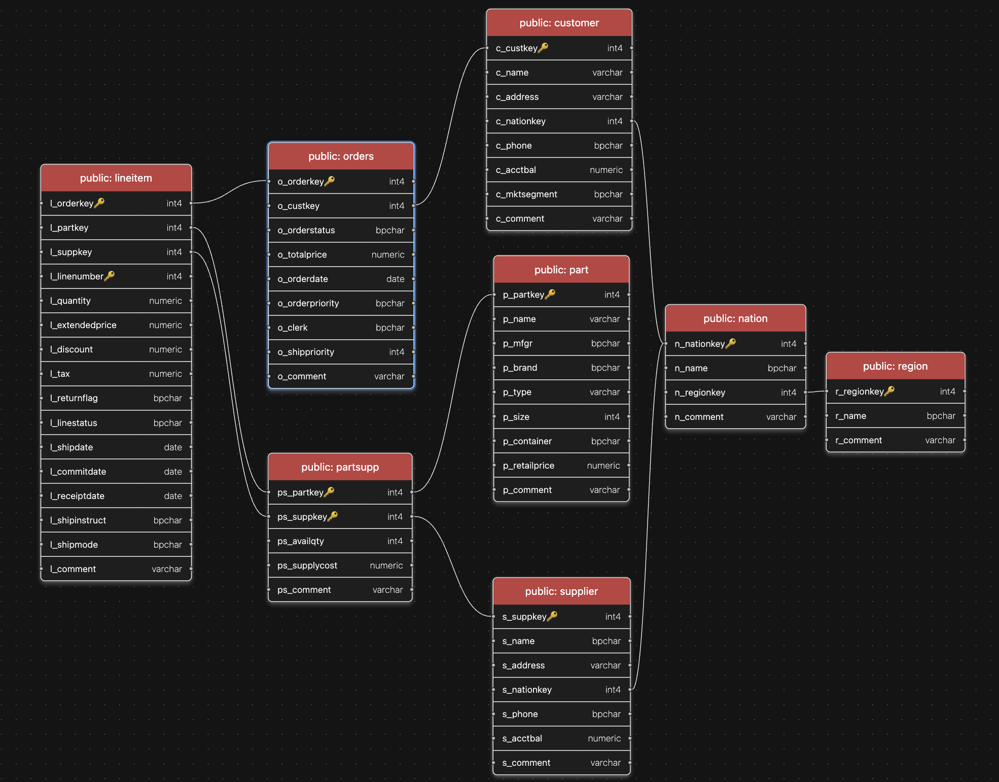

# 📚 Studying SQL: TPC-H Database Query Review

Comprehensive review on SQL queries using the [TPC-H](https://www.tpc.org/tpch/) benchmark database in PostgreSQL.

---

## 📑 Table of Contents
1. [TPC-H Database Schema](#tpc-h-database-schema)
2. [Why TPC-H?](#why-tpc-h)
3. [SQL Primer](#sql-primer)
4. [Examples](#examples)

---

## TPC-H Database Schema





---

## Why TPC-H?

The TPC-H database is a standard for benchmarking decision support systems. Its schema and data are ideal for practicing complex SQL queries, including joins, aggregations, and subqueries.

---
# SQL Primer: Concepts & Fundamentals

Structured Query Language (SQL) is used for managing and querying relational databases.

## Tables
A table is a collection of related data stored in rows and columns.
- **Rows (Records):** Individual entries.
- **Columns (Attributes):** Data fields of specific types (e.g., INTEGER, TEXT).

## Keys

### Candidate Key
-   Any column(s) that can uniquely identify a row.
-   **Example:** In a students table, both *student_id* and *email* could be candidate keys.
### Primary Key
-   The chosen candidate key that uniquely identifies each row (cannot be NULL).
-   **Example:** *student_id INT PRIMARY KEY* in the students table.
### Unique Key
-   Ensures all values are unique; can allow a NULL (varies by DBMS).
-   **Example:** *email VARCHAR UNIQUE* in the students table.
### Foreign Key
-   References the primary key of another table to establish a relationship.
-    **Example:** *student_id* in an enrollments table that references students(student_id).
### Composite Key
-   A key made of multiple columns that together uniquely identify a row.
-    **Example:** In enrollments, *student_id* + *course_id* as a composite PRIMARY KEY.
### Surrogate Key
-   An artificial key like an auto-incremented ID used as the primary key.
-   **Example:** id SERIAL PRIMARY KEY in a transactions table instead of using natural data.

## SQL Query Types

### 1. Data Query Language (DQL)
Used for querying data:
```sql
SELECT * FROM customers;
```

### 2. Data Definition Language (DDL)
Used for defining structure:
```sql
CREATE TABLE, ALTER TABLE, DROP TABLE
```

### 3. Data Manipulation Language (DML)
Used for inserting, updating, and deleting data:
```sql
INSERT INTO, UPDATE, DELETE
```

### 4. Data Control Language (DCL)
Used for permissions:
```sql
GRANT, REVOKE
```

## Joins
Used to combine rows from multiple tables.
- **INNER JOIN:** Only matching rows.
- **LEFT JOIN:** All from left, matching from right.
- **RIGHT JOIN:** All from right, matching from left.
- **FULL OUTER JOIN:** All rows with matches where possible.

## Aggregate Functions
Used for calculations on data:
- `COUNT()`, `SUM()`, `AVG()`, `MAX()`, `MIN()`

## Data Types
- Ensure values match the defined column type (e.g., `INT`, `VARCHAR`, `DATE`).
    - **Example:** A column defined as `INT` won't accept text values

## Constraints
- `NOT NULL`: Disallows null values.
- `UNIQUE`: Disallows duplicate values.
- `CHECK`: Ensures conditions.
- `DEFAULT`: Sets a default value.

## Normalization 

### 1NF (First Normal Form)

 **Goal:** Eliminate repeating groups and ensure atomicity (one value per cell).

**Rules:**
    - Each column must contain **atomic values** (no arrays or lists).
    - Each column must contain **values of the same type**.
    - Each row must be **unique**

| StudentID | Name | Courses |
| --- | --- | --- |
| 1 | Alice | Math, Science |

**Convert to 1NF:**

| StudentID | Name | Course |
| --- | --- | --- |
| 1 | Alice | Math |
| 1 | Alice | Science |

### **2NF (Second Normal Form)**

**Goal:** Remove **partial dependencies** (where a non-key column depends on part of a composite key).

**Rules:**

- Must be in **1NF**.
- All non-key columns must be **fully dependent** on the **entire primary key**.

**Goal:** Remove **partial dependencies** (where a non-key column depends on part of a composite key).

 **Example: Not in 2NF (composite key issue):**

| StudentID | CourseID | StudentName | CourseName |
| --- | --- | --- | --- |

**Convert to 2NF (split tables):**

- **Students Table:** (StudentID, StudentName)
- **Courses Table:** (CourseID, CourseName)
- **Enrollments Table:** (StudentID, CourseID)

### **3NF (Third Normal Form)**

**Goal:** Remove **transitive dependencies** (when a non-key column depends on another non-key column).

**Rules:**

- Must be in **2NF**.
- Non-key columns should depend **only** on the **primary key**.

 **Example: Not in 3NF:**
| EmployeeID | Name | DeptID | DeptName |
| --- | --- | --- | --- |

> DeptName depends on DeptID, not directly on EmployeeID.
> 

🚀 **Convert to 3NF:**

- **Employee Table:** (EmployeeID, Name, DeptID)
- **Department Table:** (DeptID, DeptName)

## Examples

* Some attribute names might differ *

#### 1. Grant Bob access to read and write customer data?
```sql
GRANT SELECT, INSERT, UPDATE, DELETE ON customer TO bob;
```

### 2. Create a table
- Primary key (PRIMARY KEY)
- Auto-increment identity (GENERATED ALWAYS AS IDENTITY)
- Foreign key with action (ON DELETE SET NULL)
- Uniqueness (UNIQUE)
- Defaults (DEFAULT now(), DEFAULT 'active')
- Validation (CHECK (salary >= 0), enum-like check on status)
- Indexing for faster lookups
```sql
-- Parent table
CREATE TABLE departments (
    department_id BIGINT GENERATED ALWAYS AS IDENTITY PRIMARY KEY,
    name          TEXT   NOT NULL UNIQUE,
    created_at    TIMESTAMPTZ NOT NULL DEFAULT now()
);

-- Child table referencing departments
CREATE TABLE employees (
    employee_id   BIGINT GENERATED ALWAYS AS IDENTITY PRIMARY KEY,
    department_id BIGINT NOT NULL REFERENCES departments(department_id)
                              ON DELETE SET NULL,
    email         VARCHAR(255) NOT NULL UNIQUE,
    first_name    TEXT NOT NULL,
    last_name     TEXT NOT NULL,
    salary        NUMERIC(12,2) CHECK (salary >= 0),
    status        TEXT NOT NULL DEFAULT 'active'
                       CHECK (status IN ('active','inactive','terminated')),
    hired_at      DATE NOT NULL DEFAULT CURRENT_DATE
);

-- Helpful index for common queries
CREATE INDEX idx_employees_department_created
    ON employees(department_id, hired_at);
****
```

#### 2. Return the name, address, and phone number of all suppliers whose account balance is lower than 0:
```sql
SELECT s_name, s_address, s_phone
FROM supplier
WHERE s_acctbal < 0 
```

### 3. List the names of customers who have placed at least 5 orders, along with the total amount they have spent (sum of o_totalprice) and their nation name. Order the results by total spent in descending order.
- Query result should include:
  - c_name (customer name)
  - n_name (nation name)
  - order_count (number of orders placed)
  - total_spent (total amount spent by the customer)
- Aggregate functions are not allowed in GROUP BY because they are calculated after that phase.
```sql
SELECT customer.c_name, nation.n_name AS nation_name,
       COUNT(orders.o_orderkey) AS order_count,
       SUM(orders.o_totalprice) AS total_spent

FROM customer

JOIN orders ON customer.c_custkey = orders.o_custkey
JOIN nation ON customer.c_nationkey = nation.n_nationkey

GROUP BY c_name, nation.n_name,
HAVING COUNT(orders.o_orderkey) >= 5
ORDER BY total_spent DESC;

```

### 4. Find the top 10 suppliers who have supplied the largest total quantity of parts, and list their name, the total quantity supplied, and their nation name.

*The JOIN clause starts with the table you're adding*

```sql
SELECT s_name, 
       n_name,
       SUM(lineitem.l_quantity) AS total_quantity

FROM supplier

JOIN nation ON supplier.s_nationkey = nation.n_nationkey
JOIN lineitem ON supplier.s_suppkey = lineitem.l_suppkey

GROUP BY s_name, n_name
LIMIT 10;
```

### 5. Find the names of parts that cost more than $100 (based on p_retailprice), along with their part type and size, sorted by price in descending order.

*GROUP BY is used when you want to aggregate data — that is, to compute a value per group of rows.*

```sql

SELECT p_name, p_type, p_size, p_retailprice

FROM part

WHERE part.p_retailprice > 100
ORDER BY part.p_retailprice DESC;
```

### 6. Find the total revenue (l_extendedprice * (1 - l_discount)) for each nation, and list them sorted by revenue in descending order.

- Since the revenue in TPC-H is based on customer purchases *(orders + lineitems)* — not supplier costs or inventory. We use the following join sequence.
  - *lineitem → orders → customer → nation*
- Do not do an *implicit join* EVER!!
    ```sql
      FROM lineitem, orders, customer, nation
    ```
    - As it will be inefficient and create a Cartesian product on the tables.
- *Explicit joins* are more structured, safer, and easier to maintain.
```sql
SELECT n_name, SUM(l_extendedprice * ( 1 - l_discount)) AS revenue

-- Explicit Join on *lineitem → orders → customer → nation*
FROM lineitem
 
JOIN orders ON lineitem.l_orderkey = orders.o_orderkey
JOIN customer ON orders.o_custkey = customer.c_custkey
JOIN nation ON customer.c_nationkey = nation.n_nationkey

GROUP BY n_name
ORDER BY revenue DESC
```

### 7. Find the names, order ID, and price of the order for customers who have placed an order above the average total order price.
```sql
SELECT c_name, o_orderkey, o_totalprice
FROM customer
JOIN orders ON customer.c_custkey = orders.o_custkey
-- Nested query to calculate the average
WHERE orders.o_totalprice > (
    SELECT AVG(o_totalprice)
    FROM orders
);
```

### 8. For each customer, show their name and the total number of orders they’ve placed.
- Uses a setbased operation instead of a nested query for optimization
```sql
  SELECT c_name, HAVING COUNT(o_orderkey) > 0 AS order_count
  FROM customer
  JOIN orders ON customer.c_custkey = orders.o_custkey
  GROUP BY c_name
  ORDER BY order_count DESC
```

### 9. Top Orders per Customer with Revenue Rank & Change
```sql
WITH
    ranked_orders AS (
        -- Select customer name, order key, and total price
        SELECT
            c.c_name,
            o.o_orderkey,
            o.o_totalprice,
            c.c_custkey,
            -- Calculate the rank of each order based on total price for each customer
            ROW_NUMBER() OVER (
                PARTITION BY
                    c_custkey
                ORDER BY
                    o_totalprice DESC
            ) AS ranking,
            -- Get the previous order's total price for each customer
            LAG (o_totalprice) OVER (
                PARTITION BY
                    c_custkey
                ORDER BY
                    o_orderkey DESC
            ) AS prev_price
        FROM
            customer c
            JOIN orders o ON c.c_custkey = o.o_custkey
    )
-- Compute the difference between the current order's total price and the previous order's total price
SELECT
    c_name,
    o_orderkey, 
    ROUND(o_totalprice,1) AS total_price,
    ROUND(o_totalprice - prev_price,1) AS price_diff,
    CONCAT (
        ROUND((o_totalprice - prev_price) / prev_price * 100),
        '%'
    ) AS percent_change
FROM
    ranked_orders
WHERE
    ranking <= 3
    AND prev_price IS NOT NULL
```
#### 🧠 Step-by-Step Analysis

#### 1. 🧱 CTE: `ranked_orders`

This **Common Table Expression** prepares a ranked list of orders per customer along with their previous order’s price.

```sql
WITH ranked_orders AS (
  ...
)
```
##### Inside the CTE:
  - c.c_name, o.o_orderkey, o.o_totalprice, c.c_custkey are selected.
  - ROW_NUMBER() ranks each customer's orders from highest to    - lowest total price.
  - LAG(o_totalprice) retrieves the previous order's total price, ordered by o_orderkey DESC.

#### 2. 🧾 Main Query
After the CTE, the outer query looks like:
```sql
SELECT ...
FROM ranked_orders
WHERE ranking <= 3 AND prev_price IS NOT NULL;
```
##### What it does:
  - Filters to show only the top 3 orders per customer (ranking <= 3)
  - Excludes the first order (since it has no prev_price)
  - Calculates:
    - price_diff: Difference between current and previous order price
    - percent_change: Percentage change from the previous order's price

### 9. Identify the Top Supplier per Nation by Revenue

```sql 
SELECT n_name, SUM(l_extendedprice * ( 1 - l_discount)) AS revenue
FROM lineitem

JOIN supplier ON l_suppkey = s_suppkey
JOIN nation ON s_nationkey = n_nationkey

WHERE l_shipdate BETWEEN DATE '1997-01-01' AND DATE '1997-12-31'

GROUP BY n_name
ORDER BY revenue DESC

```

### 10. Average Discount Given by Region for High-Value Orders

```sql
SELECT 
    r.r_name, 
    AVG(l.l_discount) AS avg_discount
FROM 
    lineitem l
JOIN 
    orders o ON l.l_orderkey = o.o_orderkey
JOIN 
    customer c ON o.o_custkey = c.c_custkey
JOIN 
    nation n ON c.c_nationkey = n.n_nationkey
JOIN 
    region r ON n.n_regionkey = r.r_regionkey
WHERE 
    o.o_totalprice > 300000
GROUP BY 
    r.r_name
ORDER BY 
    avg_discount DESC;
```

### 11. Find customers who placed at least 3 orders, each more expensive than the previous one.

```sql
-- Step 1: Rank each customer's orders by order date
WITH
    ranked_orders AS (
        SELECT
            o_orderkey,
            o_custkey,
            o_orderdate,
            o_totalprice,
            ROW_NUMBER() OVER (
                PARTITION BY
                    o.o_custkey
                ORDER BY
                    o.o_orderdate DESC
            ) AS order_rank,
            LAG (o_totalprice) OVER (
                PARTITION BY
                    o_custkey
                ORDER BY
                    o_orderdate DESC
            ) AS prev_totalprice
        FROM
            orders o
    ),
    -- Step 2: Filter to only those orders where the current price > previous
    increasing_orders AS (
        SELECT
            *
        FROM
            ranked_orders
        WHERE
            prev_totalprice IS NOT NULL
            AND o_totalprice > prev_totalprice
    ),
    -- Step 3: Count how many increasing steps each customer has
    customer_increase_counts AS (
        SELECT
            o_custkey,
            COUNT(*) AS increase_steps
        FROM
            increasing_orders
        GROUP BY
            o_custkey
    )
SELECT
    c.c_name,
    c.c_custkey,
    increase_steps + 1 AS order_count,
    TRUE AS increasing_order_pattern
FROM
    customer_increase_counts cic
    JOIN customer c ON cic.o_custkey = c.c_custkey
WHERE
    increase_steps >= 2
ORDER BY
    order_count DESC;
```

### 12. The total number of parts supplied by each supplier whose account balance is below 0:

```sql
SELECT s.s_name, COUNT(DISTINCT ps.ps_partkey) AS total_parts
FROM supplier s
JOIN partsupp ps ON s.s_suppkey = ps.ps_suppkey
WHERE s.s_acctbal < 0
GROUP BY s.s_name
```

### 13. The total number of parts supplied from each different nation (each nation has a different nationkey).
```sql
    SELECT n.n_name, COUNT(DISTINCT ps.ps_partkey) AS total_parts
    FROM nation n
    JOIN supplier s ON n.n_nationkey = s.s_nationkey
    JOIN partsupp ps ON s.s_suppkey = ps.ps_suppkey
    GROUP BY n.n_name
```

### 14. The distinct names of parts, each of which has been supplied by at least two nations
```sql
    SELECT p.p_name, COUNT(DISTINCT n_nationkey) AS nation_count
    FROM part p, supplier s
    JOIN partsupp ON s_suppkey = ps_suppkey
    JOIN nation ON ps_nationkey = n_nationkey
    WHERE nation_count >= 2
    GROUP BY p.p_name
```

### 15. The names of all suppliers who supply the most number of parts


### 16. Return the distinct names of suppliers, each of which has supplied at least two parts 
